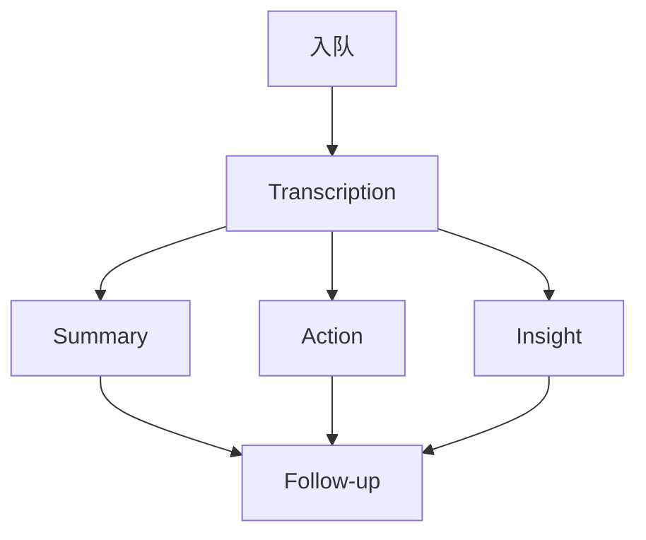

# docs/zh 与 code README 文档约定

改 `docs/zh/**` 或 `code/**/README.md`（含 `code/README.md`）时必须遵守以下三条。改前先读目标文件的一级标题（首个 `# ` 行）。

## 1. code README：禁止引用 docs/zh 路径

`code/` 下任意 `README.md` **不得**出现 `docs/zh/...`、`../docs/zh/...` 等路径，也不得用裸文件名冒充链接（如 `` `docs/zh/configuration.md` ``）。

需要指向中文文档时：用该文档的 **一级标题** 作称谓，纯文字即可（站点不托管 `code/` 静态页，不必硬造相对链接）。

| 错误 | 正确 |
|------|------|
| 详见 `docs/zh/configuration.md` | 详见「配置文件说明」 |
| 见 `docs/zh/api-reference.md` | 见「API 参考文档」 |
| 文档：`docs/zh/database-schema.md` | 文档：「数据库及表结构设计」 |

可指向仓库内代码路径（`env.example`、`src/...`）——本条只禁 `docs/zh`。

## 2. docs/zh：内部链接文案 = 目标 md 一级标题

`docs/zh` 内指向其他 `.md` 的 Markdown 链接，**显示名必须与目标文件一级标题完全一致**（含空格、标点、数字前缀），禁止缩写、别名、「教程 05」这类截断。

```markdown
<!-- 错误 -->
见 [配置](./configuration.md)
见 [API](./api-reference.md)
下一篇: [03 - 多Agent编排](03-multi-agent.md)
[查看完整八股文 →](interview/eight-part-essay.md)

<!-- 正确 -->
见 [配置文件说明](./configuration.md)
见 [API 参考文档](./api-reference.md)
下一篇: [教程 03 - 多Agent编排](03-multi-agent.md)
[八股文大全 - 多Agent智能会议助手](interview/eight-part-essay.md)
```

锚点链接（`#section`）的显示名可描述小节；跨文档时文档名部分仍用 H1。

指向 `code/**/README.md` 的链接不受「必须用 H1」约束（可用仓库路径或稳定外链），但文案须能区分语言目录。

### 当前 H1 速查（改文件后以文件为准）

| 文件 | 一级标题 |
|------|----------|
| `index.md` | 多Agent智能会议助手系统 |
| `architecture.md` | 架构设计详解 |
| `configuration.md` | 配置文件说明 |
| `database-schema.md` | 数据库及表结构设计 |
| `api-reference.md` | API 参考文档 |
| `tutorial/00-prerequisites.md` | 教程 00 - 环境准备（小白版） |
| `tutorial/01-understanding-agents.md` | 教程 01 - 理解 Agent |
| `tutorial/02-first-agent.md` | 教程 02 - 第一个 Agent |
| `tutorial/03-multi-agent.md` | 教程 03 - 多Agent编排 |
| `tutorial/04-meeting-system.md` | 教程 04 - 会议系统实战 |
| `tutorial/05-deployment.md` | 教程 05 - 部署上线 |
| `interview/eight-part-essay.md` | 八股文大全 - 多Agent智能会议助手 |
| `interview/star-method.md` | STAR 法面试话术 - 多 Agent 智能会议助手 |
| `interview/resume-template.md` | 简历模板 - 多Agent智能会议助手 |
| `interview/project-qa.md` | 项目面试问答 30+ 题 |
| `interview/system-design.md` | 系统设计面试要点 - 多Agent会议助手 |

新增/改名 md 时：更新本表，并全局修正指向该文件的链接文案。

## 3. 架构图 / 流程图：用 Mermaid 重构且语义不变

架构图、流程图、状态机、数据流、分层示意：

1. **优先 Mermaid**（` ```mermaid `），站点已接 `vitepress-plugin-mermaid`。
2. **语义对齐改造前**：节点集合、依赖方向、并行/汇聚、分层边界与改造前一致；不得为「好看」删节点或改边。
3. **线条清晰**：
   - 能 `TB`/`LR` 表达主流向就定一个主方向，少交叉。
   - Fan-out / Fan-in 用显式边或 `A --> B & C`，勿用含糊的「一条线代表多路」。
   - 跨层边接到具体节点，不悬空接到 subgraph 标题。
   - 长标签用 `<br/>` 或短 ID + 可读 label；节点 ID 用短英文，展示名用中文。
   - 复杂图可拆「总体架构 / 编排流水线 / 数据流」多张，但合起来须覆盖原图信息。

### 改造检查清单

```
- [ ] 已读改造前图（ASCII / 图片 / 旧 Mermaid），列出节点与边
- [ ] 新 Mermaid 节点与边一一对应（可注明「等价于原 X」的仅在审阅时用，勿写入正文）
- [ ] 主方向统一；并行汇聚可读
- [ ] VitePress 能渲染（本地 docs:dev 抽查）
- [ ] 图下说明文字与图一致，未残留「见上图 PNG」类失效引用
```

### 推荐写法（与现网 Pipeline 一致）



ASCII 盒图、手绘树、电路式熔断示意等凡属架构/流程，均按上节改为 Mermaid；纯表格、代码块、ER 已是 Mermaid 的保持即可。

## 执行顺序（改文档时）

1. 改 `code/**/README.md`：扫 `docs/zh`，换成「H1」称谓。
2. 改 `docs/zh`：扫 `](.*\.md)`，核对链接文案 = 目标 H1。
3. 遇架构/流程图：先对照原文，再写 Mermaid，最后按检查清单核对。

不要顺手改无关章节；只动链接文案、路径引用与图本身（及紧挨着的失效图注）。
